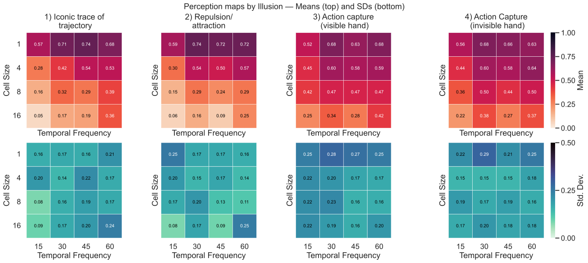
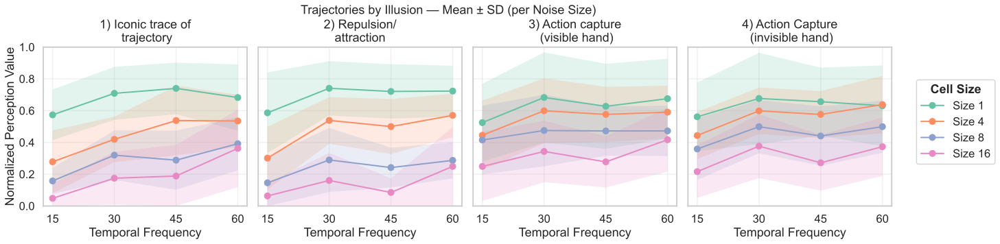
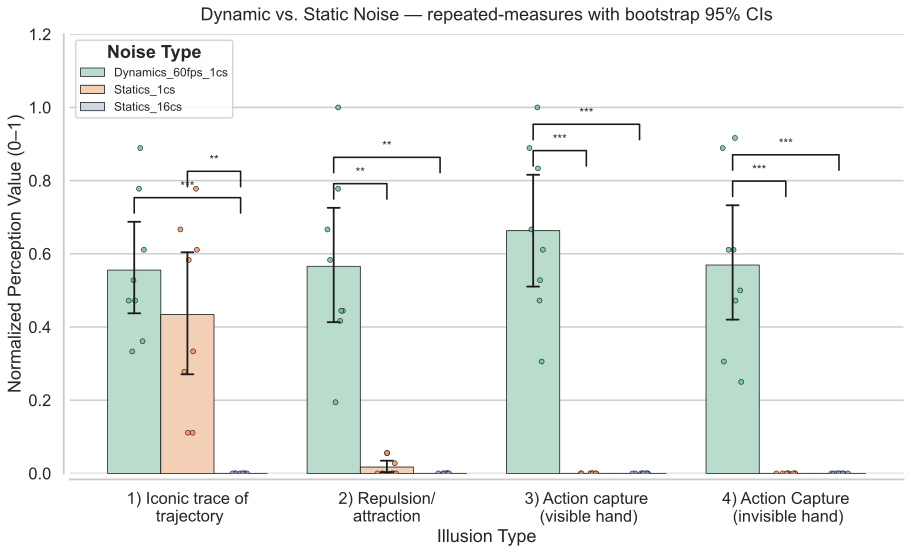
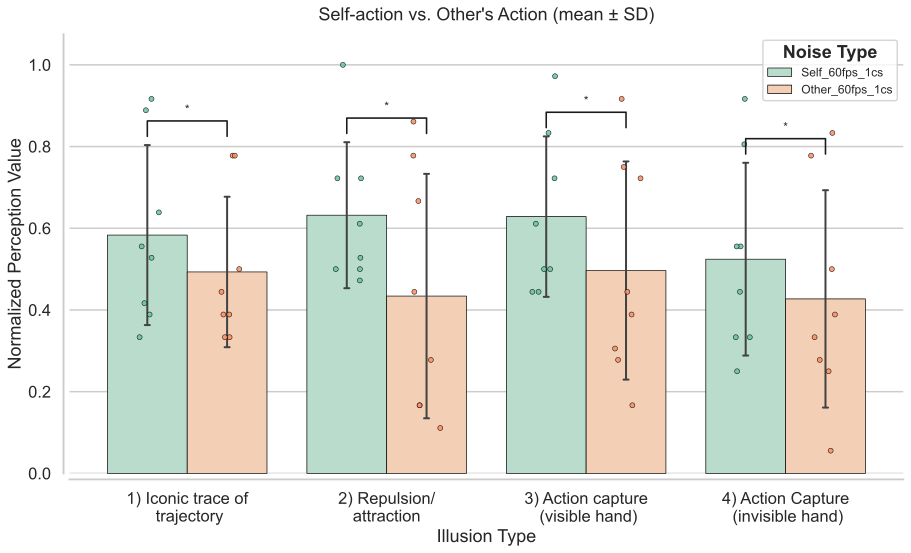

# Magnetic-Sand-Illusions

This repository contains the code and resources for generating noise videos and analyzing data from the research paper _"Magnetic Sand Illusions"_ by [Shimojo et al., BioRxiv 2024](https://www.biorxiv.org/content/10.1101/2024.07.03.598775v2). The project explores the visual and perceptual phenomena of "magnetic sand" illusions, revealing how certain noise patterns can evoke illusionary motion.

A demo of the **Magnetic Sand Illusion** is available [here](https://sites.google.com/view/magneticsand).

## Table of Contents

- [Usage](#usage)
- [Data and Analysis](#data-and-analysis)
- [Files and Structure](#files-and-structure)
- [License](#license)

## Usage

This repository provides Jupyter Notebooks and Python scripts to generate noise videos and analyze the experimental data. Below are instructions for running the key components:

1. **Noise Video Generation:**

   To generate noise videos with different parameter combinations (e.g., varying cell size and temporal frequency), use the provided notebook:
   
   [Magnetic Sand Illusion Video Generator](https://colab.research.google.com/github/cantonsir/Magnetic-Sand-Illusions/blob/main/Videos/Magnetic_sand_illusion.ipynb)

   

2. **Data Analysis:**

   The following Jupyter Notebooks provide a detailed analysis of different psychophysics experiments:

   - **Sensitivity to Parameters (Cell Size and Temporal Frequency)**:
   
     This notebook explores how changes in parameters like cell size and temporal frequency affect perception:
   
     [Parameter Sensitivity Notebook](https://colab.research.google.com/github/cantonsir/Magnetic-Sand-Illusions/blob/main/Notebook/Parameter_Space.ipynb)

        
   
     ### Mean Illusions
     

     ### Perception Maps
     

     ### Trajectories by Illusion
     
   
   - **Comparison of Dynamic vs. Static Noises**:
   
     This notebook compares participants' reactions to dynamic and static noise patterns:
   
     [Dynamic vs. Static Notebook](https://colab.research.google.com/github/cantonsir/Magnetic-Sand-Illusions/blob/main/Notebook/Statics_vs_Dynamics.ipynb)

        

     
   
   - **Self Action vs. Observing Others**:
   
     This notebook examines differences between self-action (moving) and observing others' movement:
   
     [Self vs. Other Notebook](https://colab.research.google.com/github/cantonsir/Magnetic-Sand-Illusions/blob/main/Notebook/Self_vs_Other.ipynb)

           
     

## Data and Analysis

All experimental data, data preprocessing, and visualizations are included in the Jupyter Notebooks provided in the repository. These notebooks include:

- Code for generating noise videos using varying parameters.
- Data analysis from psychophysics experiments, studying the perception of noise patterns and illusionary motion.
- Visualizations to interpret the results and compare conditions across experiments.

## Files and Structure

Here is an overview of the main directories and files in the repository:

- **Videos/**: Contains Jupyter Notebooks to generate the noise videos used in the experiments.
- **Notebook/**: Contains Jupyter Notebooks for data analysis and visualizations.
- **Figure/**: Contains images and visualizations from the experiments, including results from the analysis notebooks.

## License

This project is licensed under the terms of the [LICENSE.txt](LICENSE.txt).
