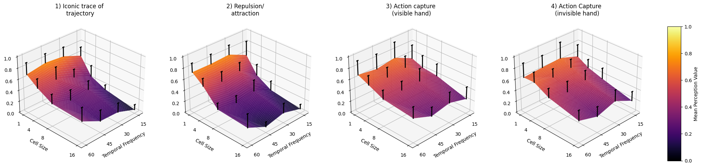

# Magnetic-Sand-Illusions

These notebooks illustrate the data analysis from different psychophysics experiments as published in Shimojo et al., BioRxiv 2024.

## Figures

### Parameter Space

### Statics vs Dynamics

### Self vs Other

