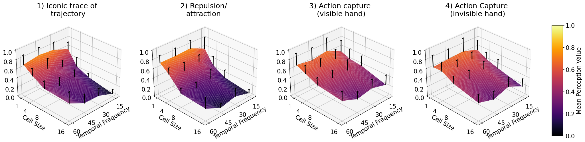
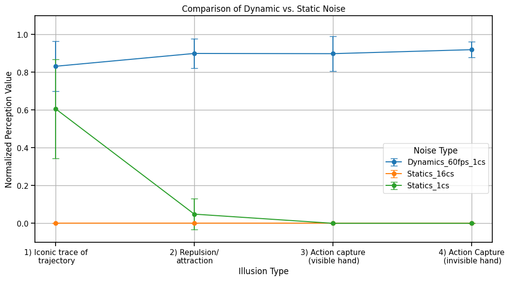
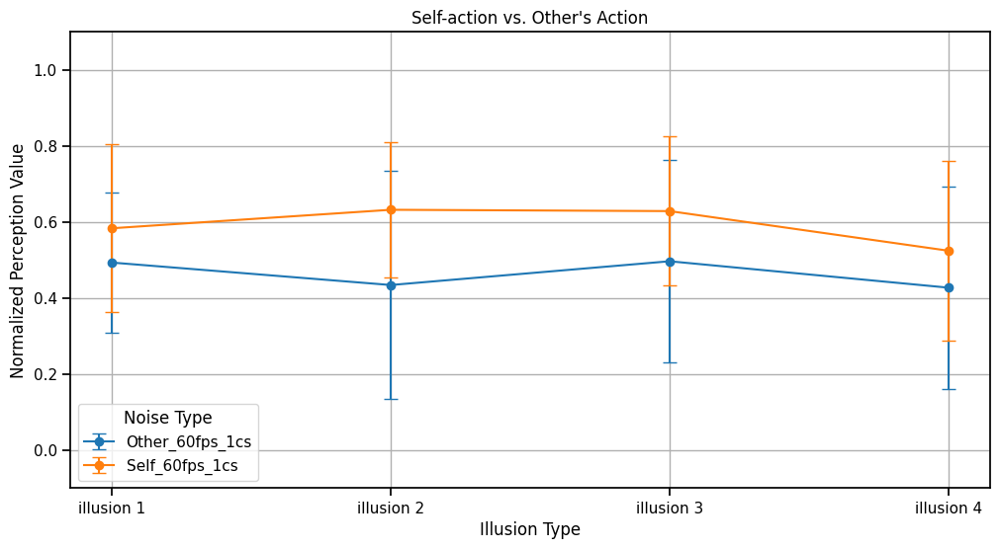

# Magnetic-Sand-Illusions

This repository contains the code for generating noise videos and results from the paper "Magnetic Sand Illusions" by Shimojo et al., BioRxiv 2024.

A demo of the **Magnetic Sand Illusion** can be found [here](https://sites.google.com/view/magneticsand).

The following Jupyter Notebooks include noise video generation and data analysis from different psychophysics experiments as published in the paper. All experimental data, data preprocessing, and visualizations are included in these notebooks.

**All data can be downloaded from Google Drive. The link to the data download is inside the Jupyter Notebooks below.**

## Videos

### Noise Video with Different Parameter Combinations

## Figures

### Sensitivity to Parameters (Cell Size and Temporal Frequency)

### Comparison of Dynamic vs. Static Noises 

### Comparison of Self Action vs. Observing Others 

